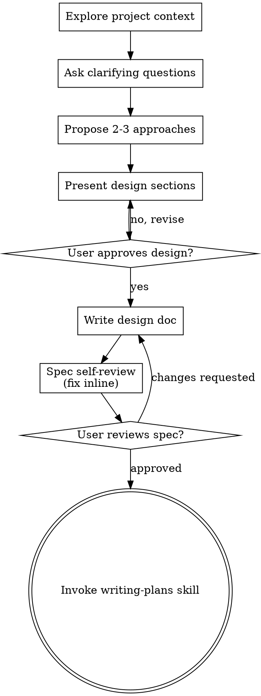

# Brainstorming Ideas Into Designs

Help turn ideas into clear plans through natural dialogue. **Assess scope first** — most tasks don't need ceremony.

## Step 1: Scope Assessment (always do this first)

Before anything else, classify the task:

| Tier | Signal | Action |
|------|--------|--------|
| **Quick** | < 30 min, clear requirements, 1-2 files, nothing architectural | Ask at most 1 question → execute |
| **Standard** | A few hours, some unknowns, a few files | Ask 2-3 focused questions → brief inline plan → execute |
| **Complex** | Multi-day, significant unknowns, multiple subsystems or new architecture | Full design flow below |

When in doubt, start with Quick/Standard and escalate if it turns out to be more involved.

---

## Quick Path

For Quick tasks:
- If requirements are clear: go directly to writing-plans (or execution)
- If one thing is genuinely unclear: ask it, then proceed
- No written spec, no design doc, no approval loops

---

## Standard Path

For Standard tasks:
1. Ask 2-3 focused questions (can ask multiple at once if they're fast to answer)
2. Briefly confirm the approach: one short paragraph
3. Get a nod from the user ("sounds good", "go ahead", or silence = proceed after 1 exchange)
4. Invoke writing-plans

No written spec file, no visual companion, no section-by-section approval.

---

## Complex Path

Use this only when the task is genuinely complex. Run the full checklist in order:

### Checklist

1. **Explore project context** — check files, docs, recent commits
2. **Ask clarifying questions** — one at a time, focus on purpose/constraints/success criteria
3. **Propose 2-3 approaches** — with trade-offs and your recommendation
4. **Present design** — in sections, get user approval after each section
5. **Write design doc** — save to `docs/superpowers/specs/YYYY-MM-DD-<topic>-design.md` and commit
6. **Spec self-review** — scan for placeholders, contradictions, scope issues; fix inline
7. **User reviews written spec** — ask user to review before proceeding
8. **Transition to implementation** — invoke writing-plans skill

### Process Flow

### Complex Path Principles

- **One question at a time** during clarification
- **YAGNI ruthlessly** — remove unnecessary features from all designs
- **Explore alternatives** — always propose 2-3 approaches before settling
- **Incremental validation** — present design, get approval before moving on
- **Design for isolation** — small units with clear responsibilities and defined interfaces

### After Writing the Spec

**Spec Self-Review:** Look at it with fresh eyes:
1. **Placeholder scan:** Any "TBD", "TODO", incomplete sections? Fix them.
2. **Internal consistency:** Do sections contradict each other?
3. **Scope check:** Is this focused enough for a single plan?
4. **Ambiguity check:** Could any requirement be interpreted two ways? Pick one.

**User Review Gate:**
> "Spec written and committed to `<path>`. Please review it and let me know if you want changes before I start the implementation plan."

Wait for response. Only proceed once approved.

---

## Key Principle

Don't make the user feel managed. Most tasks should move fast. Reserve the full ceremony for genuinely complex work where unclear requirements would cause real rework.
