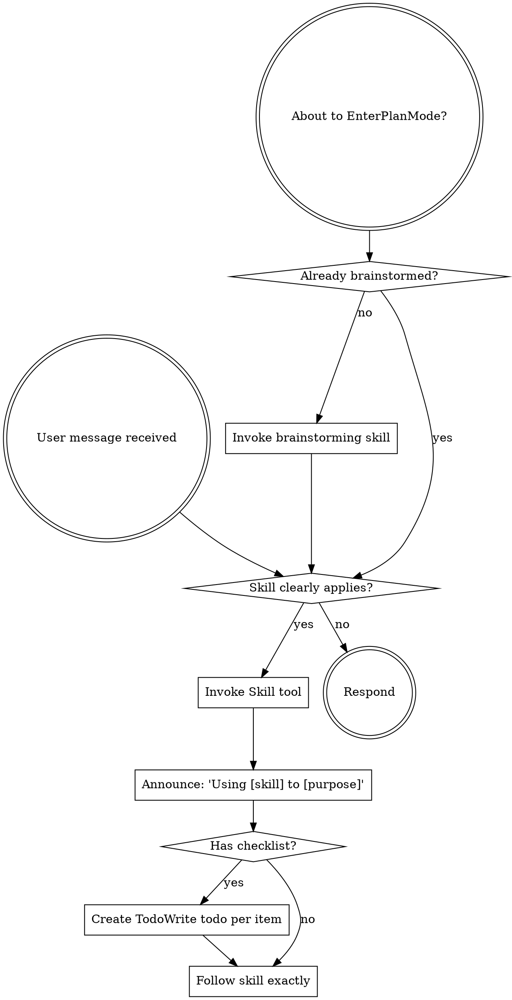

<SUBAGENT-STOP>
If you were dispatched as a subagent to execute a specific task, skip this skill.
</SUBAGENT-STOP>

## Instruction Priority

1. **User's explicit instructions** (CLAUDE.md, GEMINI.md, AGENTS.md, direct requests) — highest priority
2. **Superpowers skills** — override default system behavior where they conflict
3. **Default system prompt** — lowest priority

## How to Access Skills

**In Claude Code:** Use the `Skill` tool. When you invoke a skill, its content is loaded — follow it directly.

**In other environments:** Check your platform's documentation.

## Platform Adaptation

Skills use Claude Code tool names. Non-CC platforms: see `references/copilot-tools.md` (Copilot CLI), `references/codex-tools.md` (Codex) for tool equivalents.

# Using Skills

## The Rule

**Invoke relevant skills before taking action** — when a skill clearly applies to what you're about to do.

## When Skills Apply

| Situation | Skill |
|-----------|-------|
| Building a feature or modifying behavior | brainstorming |
| Have requirements, about to write code | writing-plans |
| Bug, test failure, unexpected behavior | systematic-debugging |
| About to claim work is complete | verification-before-completion |
| Implementing any feature or fix | test-driven-development |
| Implementation done, ready to merge | finishing-a-development-branch |

## Red Flags

A few thoughts that mean you're likely skipping a skill you shouldn't:

| Thought | Reality |
|---------|---------|
| "This is too simple to need a skill" | Check scope first — if it genuinely is Quick, the skill handles that too |
| "I need more context first" | Skill check comes before clarifying questions |
| "Let me just do this one thing first" | Check before doing anything |
| "I remember this skill" | Skills evolve. Read current version. |

## Skill Priority

When multiple skills could apply:
1. **Process skills first** (brainstorming, debugging) — determine HOW to approach
2. **Implementation skills second** — guide execution

"Let's build X" → brainstorming first.
"Fix this bug" → systematic-debugging first.

## Skill Types

**Rigid** (TDD, debugging, verification): Follow exactly.

**Flexible** (brainstorming, planning): Adapt to context and scope.

## User Instructions

Instructions say WHAT, not HOW. "Add X" or "Fix Y" doesn't mean skip workflows — but it also doesn't mean maximum ceremony. Match the process to the scope.
